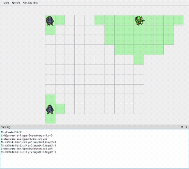
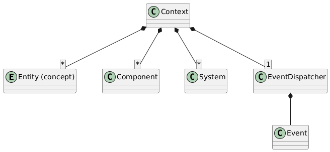

# Введение  
Проект реализует симулятор 2D тактической стратегии, основанной на сетке, с автобоем в соответствии с заданием (см. п. **Задание**).  
В качестве исходных данных используется файл с набором команд в заданном формате.  
Командами описывается состав сцены, юниты и задания для них.  
Симуляция производится изолированно, по заданным правилам, до тех пор, пока все юниты не завершат свои ходы.  
Во время симуляции действия юнитов выводятся в stdout.

# Структура проекта  
Проект разделён на четыре части:  
- статическая библиотека, реализующая симуляцию;  
- приложение для запуска симуляции из файла;  
- Qt-приложение для визуализации симуляции;

- автоматические тесты.

# Высокоуровневый дизайн  
Симулятор разделён на три уровня абстракции:  
- инструментальный слой для ввода и вывода данных (дается в задании);  
- инструментальный слой управления игровым процессом на базе ECS;  
- геймплейный слой, содержащий реализацию систем и их компонентов.

## ECS  
Компактная реализация, позволяющая создавать приложения с использованием концепции ECS.  
Обеспечивает:  
* управление игровыми сущностями и их компонентами внутри изолированного контекста;  
* итерацию по сущностям в соответствии с их архетипом;  
* создание коллекций архетипов игровых сущностей;  
* тиражирование и обработку игровых событий и команд.

**Особенности:**  
* поддерживаются произвольные типы компонентов и событий;  
* архетип не может содержать более одного компонента каждого типа;  
* имеет фиксированный, заданный пользователем порядок работы систем;  
* порядок обработки сущностей не гарантируется;  
* обработка сообщений происходит строго после завершения работы всех систем в тике;  
* поддерживается тиражирование сообщений во время их обработки;  
* безопасная регистрация обработчика сообщений во время обработки сообщений не гарантируется;  
* удаление сущностей производится отложенно;  
* поддерживаются синглтон-компоненты — для этого используется фиктивная сущность.

### Состав и структура ECS  
ECS состоит из следующих сущностей:  
* **Entity** — предназначен для обобщения компонентов в архетипы, абстракция без необходимости в специальной реализации; каждой сущности ассоциируется уникальный идентификатор.  
* **Component** — предназначен для хранения данных, ассоциируется с сущностью; в качестве компонента может использоваться любой пользовательский тип.  
* **Context** — контекст ECS-системы, предназначен для изоляции несвязанных данных, систем и событий. Отвечает за хранение сущностей, компонентов и систем, является точкой входа для доступа к диспетчеру событий.  
* **System** — базовый класс для реализации систем; предназначен для пользовательской логики, получает управление на каждом тике.  
* **EventDispatcher** — обеспечивает регистрацию обработчиков событий и отложенную диспетчеризацию. В качестве событий могут использоваться произвольные пользовательские типы.  
* **ComponentIndex** — служебный тип; индекс компонента, используется контекстом для адресации компонентов.  

### Что можно улучшить  
* Разделить хранилище компонентов по их типам, чтобы обеспечить более эффективную итерацию.  
* Не хватает автоматического построения порядка работы систем на основе их зависимостей (например, по DAG), включая обнаружение циклических и транзитивных зависимостей.

## Геймплейный слой  
Реализует логику игровых систем, содержит события и компоненты, обеспечивающие симуляцию.  
Обеспечивает:  
* обработку входных команд;  
* создание юнитов (мечник и охотник), интерпретацию их характеристик;  
* принятие решений для юнитов в порядке их создания: движение или атака;  
* движение юнитов к заданной точке;  
* определение видимости юнитами друг друга;  
* выполнение атак и расчёт урона, принятие решения о смерти юнита;  
* логирование событий согласно заданию.

### Состав и структура игрового слоя  

**Команды:**  
* `DamageCommand` — нанести урон юниту, обрабатывается `DamageSystem`;  
* `MoveCommand` — подвинуть юнита в пределах одного тика, обрабатывается `MovementSystem`;  
* `CreateMap`* — создать карту заданных размеров, обрабатывается `MovementSystem`;  
* `March`* — задать юниту маршрутную точку, обрабатывается `AISystem`;  
* `SpawnSwordsman`* — создать мечника, обрабатывается `SpawnUnitSystem`;  
* `SpawnHunter`* — создать охотника, обрабатывается `SpawnUnitSystem`.  
\* — команды даны в задании.

**Системы:**  
* `AISystem` — отвечает за принятие решений: движение к заданной точке или атака. В случае атаки — выбор цели и оружия с учетом их характеристик.  
* `DamageSystem` — отвечает за расчёт урона с учетом параметров источника и цели, а также за лечение.  
* `LoggerSystem` — отвечает за логирование команд, событий движения, урона и смерти юнитов.  
* `MovementSystem` — отвечает за перемещение юнитов и их регистрацию на сетке.  
* `SpawnUnitSystem` — обрабатывает команды создания юнитов, обеспечивает создание мечника и охотника.  
* `VisibilitySystem` — отвечает за определение видимости юнитов, обновляет список видимых целей каждый тик.

**Компоненты:**  
* `BehaviourComponent` — данные о поведении юнита для `AISystem`: приоритет, текущая цель, маршрутная точка.  
* `DamagesTakerComponent` — данные о здоровье юнита (текущее, максимальное); наличие компонента указывает, что юнит может получать урон.  
* `GridComponent` — синглтон-компонент; содержит положение юнитов и размеры сетки, управляется `MovementSystem`.  
* `MovementComponent` — координаты юнита и тип (на земле, в воздухе и т.п.), управляется `MovementSystem`.  
* `ViewerComponent` — расстояние обзора и список видимых целей, управляется `VisibilitySystem`.  
* `VisibleComponent` — параметры видимости сущности; сущность видна только при наличии этого компонента, управляется `VisibilitySystem`.  
* `WeaponComponent` — параметры оружия юнита, используется `AISystem` для выбора оружия.

**Прочее:**  
* `EntityMapping` — хранит информацию о координатах сущностей; используется для поиска по координатам.  
* `GameApp` — создаёт ECS-контекст, регистрирует системы, управляет их выполнением. По сути, основной класс приложения.

### Что можно улучшить  
* За стрельбу должна отвечать отдельная система оружия, чтобы реализовать условия применения (например, задержку), а также поражение по области или создание снарядов.  
* Система спауна должна ориентироваться на классы юнитов и их параметры, описанные в `gameparams`.  
* Использовать более релевантный алгоритм поиска сущностей в заданной области или радиусе.

# Задание

Цель задания — продемонстрировать навыки проектирования ПО. 
Не беспокойтесь о производительности, использовании потоков или подключении библиотек. 
Мы не ожидаем детерминированного результата работы, это усложнило бы задачу.
Время выполнения не ограничено, но ожидается, что оно займет не более 6–8 часов.

## Что мы хотим увидеть:
1. Простой, аккуратный код, по которому легко понять, как он работает.
2. Четкие зоны ответственности каждой сущности в проекте.
3. Архитектуру, позволяющую легко добавлять новые сущности и механики взаимодействия.
    - Представьте, что после вас придут 10 джуниор-разработчиков, которые будут одновременно добавлять новые фичи.

# Задача

Создайте пошаговую симуляцию битвы юнитов на карте для экспериментов с механиками.

Можно создать карту размером W×H клеток и разместить на ней N юнитов.
- Юниты могут быть разного типа с разными действиями и характеристиками.
- Каждый юнит может выполнить одно действие за ход.
    - Юниты действуют в порядке их создания.
- Одну клетку может занимать только один юнит.
- У всех юнитов есть уникальный идентификатор **Id** (целое число) 
- У большинства юнитов есть характеристика **HP** (Health Points).
    - Если **HP** ≤ 0, юнит исчезает на следующий ход и больше не действует.
- Некоторые юниты могут перемещаться:
    - За ход могут переместиться в любую из восьми соседних клеток.
    - Если не могут достичь цели за один ход, продолжают двигаться к ней в следующих ходах.

Симуляция заканчивается, когда нет юнитов, способных действовать в следующем ходу, или на карте остается только один юнит.

## Юниты:

### Мечник
- **Характеристики:** HP, Strength
- **Ближний бой:** Бьет одного случайного юнита в соседней клетке, нанося ему **Strength** единиц урона.
- Если некого бить, перемещается.

### Охотник
- **Характеристики:** HP, Agility, Strength, Range
- **Дальний бой:** Стреляет в случайного юнита на расстоянии от 2 до **Range** клеток, нанося ему **Agility** единиц урона. Может стрелять только если в соседних клетках нет других юнитов.
- **Ближний бой:** Если стрелять не может, бьет одного случайного юнита в соседней клетке, нанося ему **Strength** единиц урона.
- Если некого бить, перемещается.

# Приложение

При запуске приложение получает путь к файлу со сценарием симуляции, где описаны **команды** для создания карты и юнитов, а также перемещения юнитов по карте. 
Приложение должно выводить все происходящие события в **stdout**.

Так как на карте нет препятствий, сложные алгоритмы поиска пути не требуются.

## Команды

- `CREATE_MAP W H` — Создает карту размером `W`×`H`. Эта команда начинает любой сценарий.
- `SPAWN_SWORDSMAN I X Y H S` — Создает мечника с идентификатором `I` в точке `X`,`Y` с характеристиками здоровья `H` и силы `S`.
- `SPAWN_HUNTER I X Y H A S R` — Создает охотника с идентификатором `I` в точке `X`,`Y` с характеристиками здоровья `H`, ловкости `A`, силы `S` и дальности `R`.
- `MARCH I X Y` — Приказывает юниту `I` переместиться в точку `X`,`Y`.

## События

- `MAP_CREATED` — Создание карты.
- `MARCH_STARTED`, `MARCH_ENDED` — Начало и конец перемещения юнита.
- `UNIT_SPAWNED`, `UNIT_DIED` — Создание и смерть юнита.
- `UNIT_MOVED` — Перемещение юнита на клетку.
- `UNIT_ATTACKED` — Атака одного юнита на другого.

Код парсера команд и вывода событий в лог уже содержится в проекте. Если необходимо, его можно менять. Формат ввода и вывода менять нельзя.

Пример сценария находится в файле _commands_example.txt_. Пример лога событий находится в файле _main.cpp_.

# Планы

При разработке учитывайте планы по добавлению новых юнитов, действий и характеристик. 

Эта функциональность не является частью задания, а лишь подсказывает направление при проектировании.

## Башня

- **Характеристики:** HP, Power
- **Дальний бой:** Стреляет в случайного юнита на расстоянии от 2 до 5 клеток, нанося ему **Power** единиц урона.
- Не может перемещаться.

## Лекарь

- **Характеристики:** HP, Spirit
- **Лечение:** Восстанавливает **Spirit** единиц здоровья одному случайному юниту в радиусе 2 клеток.
- Если некого лечить, перемещается.

## Ворон

- **Характеристики:** HP, Agility
- **Летающий юнит:**
    - Не занимает клетку на карте.
    - Может перемещаться на 2 клетки за ход.
    - Не может быть атакован ближнем боем.
    - Может быть атакован в дальнем бою, минимальная и максимальная дистанция атаки "стрелка" на ворона снижена на 1.
- **Ближний бой:** Бьет одного случайного юнита в соседних клетках, нанося ему **Agility** единиц урона.
- Если некого бить, перемещается.

## Мина

- **Характеристики:** Power
- Если в радиусе 2х клеток есть юнит - взрывается в следующем ходу, нанося всем юнитам в радиусе 3х клеток **Power** единиц урона.
- После взрыва исчезает.
- Не может перемещаться.
- Не может быть атакована.
- Не занимает клетку на карте.

# Технические требования

- **ОС**: Ubuntu, MacOS или Windows
- **Стандарт:** C++17 или новее
- **Система сборки:** cmake (в проекте должен быть CMakeLists.txt)
- Задание необходимо опубликовать в любом публичном гит-репозитории (GitHub, Bitbucket и т.д.).

_В процессе выполнения задания вы можете присылать любые вопросы._